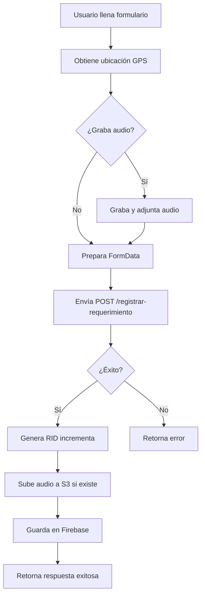

# Endpoint: Registrar Requerimiento

## 📋 Descripción General

El endpoint `POST /registrar-requerimiento` permite registrar nuevos requerimientos con información del solicitante, ubicación GPS, estado, nota de voz opcional y organismos encargados.

---

## 🔗 URL del Endpoint

```
POST /registrar-requerimiento
```

---

## 📥 Parámetros de Entrada

### Campos Requeridos

| Campo | Tipo | Descripción | Ejemplo |
|-------|------|-------------|---------|
| `vid` | string | ID de la visita | `"VID-1"` |
| `centro_gestor_solicitante` | string | Centro gestor del solicitante | `"DAGMA"` |
| `solicitante_contacto` | string | Nombre del contacto solicitante | `"María López García"` |
| `requerimiento` | string | Descripción del requerimiento | `"Solicitud de mejoramiento vial"` |
| `observaciones` | string | Observaciones adicionales | `"Vía en mal estado"` |
| `direccion` | string | Dirección del requerimiento | `"Calle 5 # 40-20"` |
| `barrio_vereda` | string | Barrio o vereda | `"San Fernando"` |
| `comuna_corregimiento` | string | Comuna o corregimiento | `"Comuna 3"` |
| `coords` | string (JSON) | Coordenadas GPS | `{"lat": 3.4516, "lng": -76.5320}` |
| `telefono` | string | Número de teléfono de contacto | `"+57 300 1234567"` |
| `email_solicitante` | string | Correo electrónico del solicitante | `"maria.lopez@example.com"` |
| `organismos_encargados` | string (JSON Array) | Lista de organismos encargados | `["DAGMA", "Secretaría de Obras"]` |

### Campos Opcionales

| Campo | Tipo | Descripción |
|-------|------|-------------|
| `nota_voz` | File | Archivo de audio (MP3, WAV, OGG, WEBM, M4A) |

---

## 📤 Respuesta

### Respuesta Exitosa (200 OK)

```json
{
  "success": true,
  "vid": "VID-1",
  "rid": "REQ-1",
  "message": "Requerimiento registrado exitosamente",
  "centro_gestor_solicitante": "DAGMA",
  "solicitante_contacto": "María López García",
  "requerimiento": "Solicitud de mejoramiento vial",
  "observaciones": "Vía en mal estado",
  "direccion": "Calle 5 # 40-20",
  "barrio_vereda": "San Fernando",
  "comuna_corregimiento": "Comuna 3",
  "coords": {
    "lat": 3.4516,
    "lng": -76.5320
  },
  "estado": "Pendiente",
  "nota_voz_url": "https://bucket.s3.amazonaws.com/requerimientos/VID-1/REQ-1/nota_voz_abc123.mp3",
  "telefono": "+57 300 1234567",
  "email_solicitante": "maria.lopez@example.com",
  "fecha_registro": "2026-02-06T15:30:45.123456",
  "organismos_encargados": [
    "DAGMA",
    "Secretaría de Obras Públicas"
  ],
  "timestamp": "2026-02-06T15:30:45.123456"
}
```

### Respuesta de Error (400 Bad Request)

```json
{
  "detail": "Formato de coords inválido. Debe ser JSON con 'lat' y 'lng': ..."
}
```

### Respuesta de Error (500 Internal Server Error)

```json
{
  "detail": "Error registrando requerimiento: ..."
}
```

---

## 🔑 Características Especiales

### 1. RID (ID de Requerimiento) Incremental

- **Formato**: `REQ-#`
- **Comportamiento**: El número es incremental **dentro de cada visita (VID)**
- **Ejemplo**: 
  - Para VID-1: REQ-1, REQ-2, REQ-3...
  - Para VID-2: REQ-1, REQ-2, REQ-3...

### 2. Estado por Defecto

- Todos los requerimientos se crean con estado **"Pendiente"**

### 3. Fecha de Registro Automática

- Se registra automáticamente el timestamp del momento en que se crea el requerimiento
- Formato ISO 8601

### 4. Coordenadas GPS

- Se validan las coordenadas:
  - Latitud: -90 a 90
  - Longitud: -180 a 180
- Deben enviarse como string JSON: `{"lat": 3.4516, "lng": -76.5320}`

### 5. Nota de Voz Opcional

- **Formatos soportados**: MP3, WAV, OGG, WEBM, M4A
- Se sube a AWS S3
- Se retorna la URL del archivo
- Si no se proporciona, `nota_voz_url` será `null`

### 6. Múltiples Organismos Encargados

- Permite asignar múltiples organismos responsables
- Se envía como array JSON: `["DAGMA", "Secretaría de Obras", "Planeación"]`

---

## 📝 Ejemplos de Uso

### Ejemplo 1: JavaScript con FormData (sin audio)

```javascript
const coords = JSON.stringify({ lat: 3.4516, lng: -76.5320 });
const organismos = JSON.stringify(["DAGMA", "Secretaría de Obras"]);

const formData = new FormData();
formData.append('vid', 'VID-1');
formData.append('centro_gestor_solicitante', 'DAGMA');
formData.append('solicitante_contacto', 'María López García');
formData.append('requerimiento', 'Solicitud de mejoramiento vial');
formData.append('observaciones', 'Vía en mal estado');
formData.append('direccion', 'Calle 5 # 40-20');
formData.append('barrio_vereda', 'San Fernando');
formData.append('comuna_corregimiento', 'Comuna 3');
formData.append('coords', coords);
formData.append('telefono', '+57 300 1234567');
formData.append('email_solicitante', 'maria.lopez@example.com');
formData.append('organismos_encargados', organismos);

const response = await fetch('http://localhost:8000/registrar-requerimiento', {
  method: 'POST',
  body: formData
});

const data = await response.json();
console.log(data);
```

### Ejemplo 2: JavaScript con FormData (con audio)

```javascript
const coords = JSON.stringify({ lat: 3.4516, lng: -76.5320 });
const organismos = JSON.stringify(["DAGMA", "Secretaría de Obras"]);

// Obtener archivo de audio desde un input
const audioInput = document.getElementById('audio-input');
const audioFile = audioInput.files[0];

const formData = new FormData();
formData.append('vid', 'VID-1');
formData.append('centro_gestor_solicitante', 'DAGMA');
formData.append('solicitante_contacto', 'María López García');
formData.append('requerimiento', 'Solicitud de mejoramiento vial');
formData.append('observaciones', 'Vía en mal estado');
formData.append('direccion', 'Calle 5 # 40-20');
formData.append('barrio_vereda', 'San Fernando');
formData.append('comuna_corregimiento', 'Comuna 3');
formData.append('coords', coords);
formData.append('telefono', '+57 300 1234567');
formData.append('email_solicitante', 'maria.lopez@example.com');
formData.append('organismos_encargados', organismos);

// Agregar archivo de audio
if (audioFile) {
  formData.append('nota_voz', audioFile);
}

const response = await fetch('http://localhost:8000/registrar-requerimiento', {
  method: 'POST',
  body: formData
});

const data = await response.json();
console.log(data);
```

### Ejemplo 3: Python con requests

```python
import requests
import json

coords = json.dumps({"lat": 3.4516, "lng": -76.5320})
organismos = json.dumps(["DAGMA", "Secretaría de Obras"])

data = {
    "vid": "VID-1",
    "centro_gestor_solicitante": "DAGMA",
    "solicitante_contacto": "María López García",
    "requerimiento": "Solicitud de mejoramiento vial",
    "observaciones": "Vía en mal estado",
    "direccion": "Calle 5 # 40-20",
    "barrio_vereda": "San Fernando",
    "comuna_corregimiento": "Comuna 3",
    "coords": coords,
    "telefono": "+57 300 1234567",
    "email_solicitante": "maria.lopez@example.com",
    "organismos_encargados": organismos
}

# Con archivo de audio
files = {
    "nota_voz": open("audio.mp3", "rb")
}

response = requests.post(
    "http://localhost:8000/registrar-requerimiento",
    data=data,
    files=files
)

print(response.json())
```

### Ejemplo 4: cURL

```bash
curl -X POST "http://localhost:8000/registrar-requerimiento" \
  -F "vid=VID-1" \
  -F "centro_gestor_solicitante=DAGMA" \
  -F "solicitante_contacto=María López García" \
  -F "requerimiento=Solicitud de mejoramiento vial" \
  -F "observaciones=Vía en mal estado" \
  -F "direccion=Calle 5 # 40-20" \
  -F "barrio_vereda=San Fernando" \
  -F "comuna_corregimiento=Comuna 3" \
  -F 'coords={"lat": 3.4516, "lng": -76.5320}' \
  -F "telefono=+57 300 1234567" \
  -F "email_solicitante=maria.lopez@example.com" \
  -F 'organismos_encargados=["DAGMA", "Secretaría de Obras"]' \
  -F "nota_voz=@audio.mp3"
```

---

## 🔒 Validaciones

### 1. Validación de Coordenadas

```python
# Latitud debe estar entre -90 y 90
# Longitud debe estar entre -180 y 180
if not (-90 <= lat <= 90):
    raise ValueError("Latitud inválida")
if not (-180 <= lng <= 180):
    raise ValueError("Longitud inválida")
```

### 2. Validación de Archivo de Audio

```python
# Tipos MIME permitidos
allowed_audio_types = [
    "audio/mpeg", 
    "audio/mp3", 
    "audio/wav", 
    "audio/ogg", 
    "audio/webm", 
    "audio/m4a"
]
```

### 3. Validación de Email

- Se debe enviar un email válido en formato estándar

### 4. Validación de Organismos Encargados

- Debe ser un array JSON válido
- Debe contener al menos un organismo

---

## 🗄️ Estructura de Datos en Firebase

### Colección: `requerimientos_dagma`

**Documento ID**: `{vid}_{rid}` (Ejemplo: `VID-1_REQ-1`)

```json
{
  "vid": "VID-1",
  "rid": "REQ-1",
  "rid_number": 1,
  "centro_gestor_solicitante": "DAGMA",
  "solicitante_contacto": "María López García",
  "requerimiento": "Solicitud de mejoramiento vial",
  "observaciones": "Vía en mal estado",
  "direccion": "Calle 5 # 40-20",
  "barrio_vereda": "San Fernando",
  "comuna_corregimiento": "Comuna 3",
  "coords": {
    "lat": 3.4516,
    "lng": -76.5320
  },
  "estado": "Pendiente",
  "nota_voz_url": "https://...",
  "telefono": "+57 300 1234567",
  "email_solicitante": "maria.lopez@example.com",
  "fecha_registro": "2026-02-06T15:30:45.123456",
  "organismos_encargados": ["DAGMA", "Secretaría de Obras"],
  "created_at": "2026-02-06T15:30:45.123456",
  "timestamp": "2026-02-06T15:30:45.123456"
}
```

---

## 🚀 Pruebas

### Ejecutar Pruebas

```bash
# Instalar dependencias si es necesario
pip install requests

# Ejecutar script de pruebas
python test_registrar_requerimiento.py
```

El script de pruebas incluye:

1. ✅ Registro sin archivo de audio
2. ✅ Registro con archivo de audio
3. ✅ Validación de coordenadas inválidas
4. ✅ Incremento automático del RID

---

## 📚 Documentación Interactiva

Una vez que la API esté corriendo, puedes acceder a la documentación interactiva en:

- **Swagger UI**: http://localhost:8000/docs
- **ReDoc**: http://localhost:8000/redoc

---

## ⚙️ Configuración Requerida

### Variables de Entorno

Para que el endpoint funcione correctamente, asegúrate de tener configuradas las siguientes variables de entorno:

```bash
# Firebase
FIREBASE_SERVICE_ACCOUNT_JSON={"type": "service_account", ...}

# AWS S3 (para nota de voz)
AWS_ACCESS_KEY_ID=tu_access_key
AWS_SECRET_ACCESS_KEY=tu_secret_key
AWS_REGION=us-east-1
AWS_S3_BUCKET_NAME=360-dagma-photos
```

---

## 🐛 Solución de Problemas

### Error: "Error generando RID"

**Causa**: Problema al consultar Firestore para obtener el último RID.

**Solución**: Verifica que las credenciales de Firebase estén correctamente configuradas.

### Error: "Formato de coords inválido"

**Causa**: Las coordenadas no están en formato JSON correcto.

**Solución**: Asegúrate de enviar las coordenadas como string JSON: `'{"lat": 3.4516, "lng": -76.5320}'`

### Error: "Error subiendo nota de voz"

**Causa**: Problema con la configuración de AWS S3.

**Solución**: 
1. Verifica que las credenciales de AWS estén correctas
2. Verifica que el bucket exista
3. Verifica que el tipo de archivo sea permitido

### Advertencia: Audio no sube pero el registro se guarda

**Causa**: El sistema registra el requerimiento aunque falle la subida del audio.

**Solución**: El registro será exitoso pero `nota_voz_url` será `null`. Revisa los logs para ver el error específico del audio.

---

## 📊 Casos de Uso

### 1. Registro desde Aplicación Móvil

```javascript
// Obtener ubicación GPS del dispositivo
navigator.geolocation.getCurrentPosition(async (position) => {
  const coords = {
    lat: position.coords.latitude,
    lng: position.coords.longitude
  };
  
  // Registrar requerimiento
  await registrarRequerimiento({
    ...datos,
    coords: JSON.stringify(coords)
  });
});
```

### 2. Grabación de Audio desde el Navegador

```javascript
// Grabar audio usando Media Recorder API
let mediaRecorder;
let audioChunks = [];

navigator.mediaDevices.getUserMedia({ audio: true })
  .then(stream => {
    mediaRecorder = new MediaRecorder(stream);
    
    mediaRecorder.ondataavailable = (event) => {
      audioChunks.push(event.data);
    };
    
    mediaRecorder.onstop = () => {
      const audioBlob = new Blob(audioChunks, { type: 'audio/mpeg' });
      const audioFile = new File([audioBlob], 'nota_voz.mp3', { type: 'audio/mpeg' });
      
      // Usar audioFile en FormData
      formData.append('nota_voz', audioFile);
    };
    
    mediaRecorder.start();
  });
```

### 3. Selección Múltiple de Organismos

```javascript
// Checkbox UI para selección múltiple
const organismosSeleccionados = ['DAGMA', 'Secretaría de Obras', 'Planeación'];

formData.append('organismos_encargados', JSON.stringify(organismosSeleccionados));
```

---

## 📌 Notas Importantes

1. **RID Incremental**: El RID es incremental **por visita**, no global. Cada VID tiene su propio contador.

2. **Estado Inicial**: Todos los requerimientos inician con estado "Pendiente".

3. **Archivo de Audio Opcional**: Si no se proporciona audio, `nota_voz_url` será `null`.

4. **Validación de Email**: Aunque no se valida el formato en el backend, se recomienda validarlo en el frontend.

5. **Límite de Archivo**: Verifica los límites de tamaño de archivo permitidos por tu servidor.

6. **Coordenadas Obligatorias**: Las coordenadas GPS son obligatorias y deben ser válidas.

---

## 🔄 Flujo Completo



---

## 📞 Soporte

Para más información o soporte, contacta al equipo de desarrollo.
